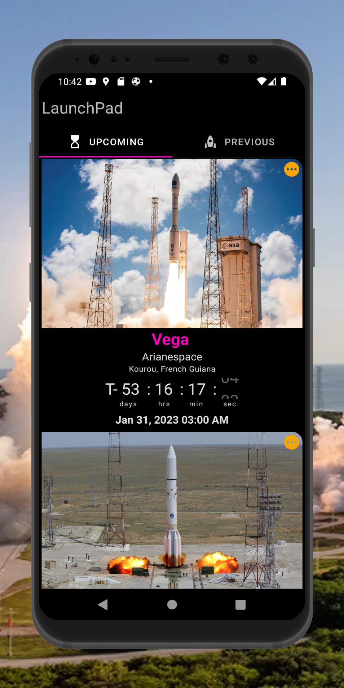
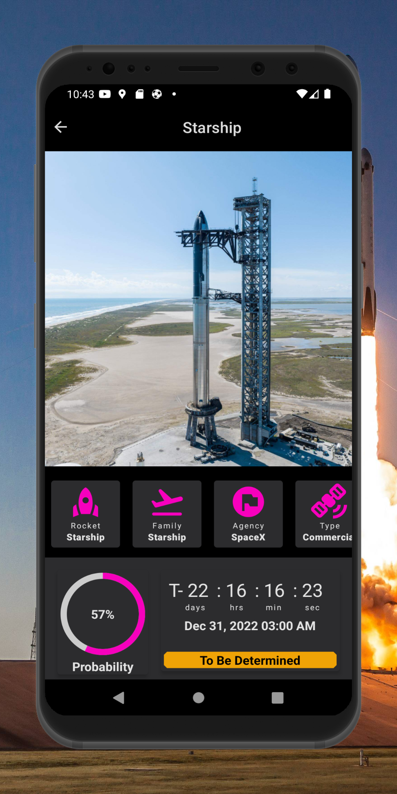
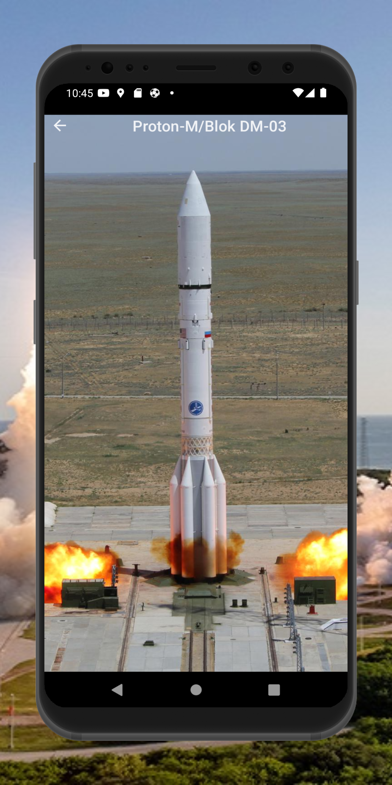
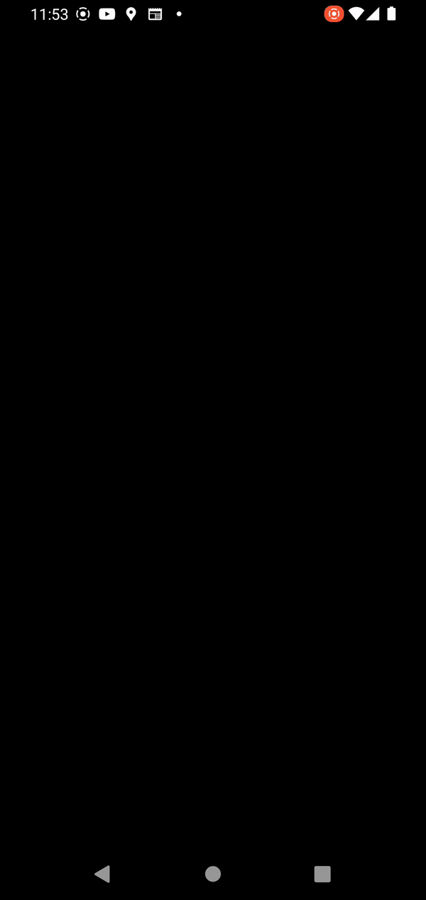
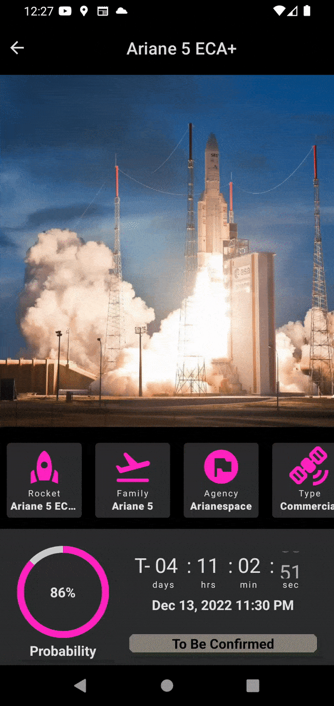
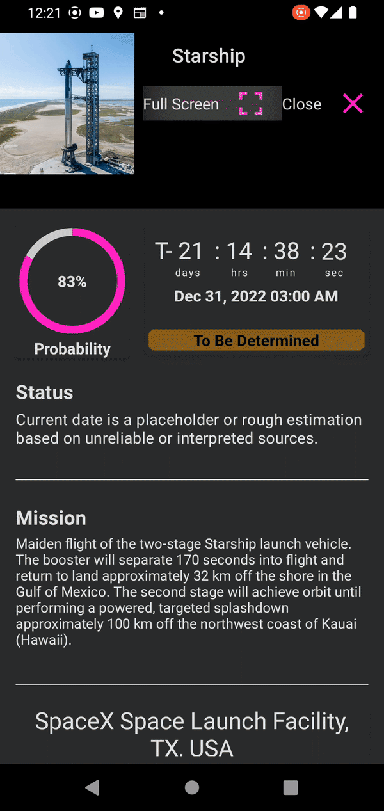

<br />
<div align="center">
  <a href="#">
    
  </a>

<h1 align = "center">
<b><i>LaunchPad</i></b>
</h1>

  <p align="center">
    Android App for Space Events
    <br />


  
[Screenshots](#camera_flash-screenshots-camera_flash) ~
[Deployment](#inbox_tray-deployment-inbox_tray) ~
[Architecture](#hammer_and_wrench-architecture-hammer_and_wrench) ~
[API Reference](#electric_plug-api-reference-electric_plug) ~
[Tech Stack](#gear-tech-stack-gear) ~
[Authors](#black_nib-authors-black_nib) ~
[Contributing](#passport_control-contributing-passport_control)  
 
</div>
    
LaunchPad shows upcoming rocket launches and previous rocket launches. It is backed up by data from the Launch Library API a product by The Space Devs with an up-to-date database of Spaceflight events.

<a href='https://play.google.com/store/apps/details?id=com.uxstate.launchpad'></a>

# :camera_flash: **Screenshots** :camera_flash:


This Project uses [**Material 2**](https://m2.material.io/design), which is a part of Google's open source design system for inituitive and consistent design patterns. 

<p align="center">
 &nbsp;&nbsp;&nbsp;&nbsp;
 &nbsp;&nbsp;&nbsp;&nbsp;   
 &nbsp;&nbsp;&nbsp;&nbsp; 

</p>

# :inbox_tray: Deployment :inbox_tray:

These are the key parameters for LaunchPad app:

| Parameter      	| Value  	|
|----------------	|--------	|
| compileSdk     	| 33     	|
| targetSdk      	| 33     	|
| minSdk         	| 26     	|
| composeVersion 	| 1.3.1  	|
| kotlinVersion  	| 1.7.20 	|


You can clone the repository or download the project as a  zip file.

# :hammer_and_wrench: Architecture 	:hammer_and_wrench:

LaunchPad is implemented using Android Clean Architecture and follows the Model-View-ViewModel 
(MVVM) pattern.

It features :three: main layers:

**1. Data Layer** - This is the layer that dispenses data to the LaunchPad app. Deep in the data layer sits 2 
RemoteMediators (yes, :two: ) to combine local and remote queries for consistent data flow to the user, regardless if the network is available or not. The mediators are flanked by a ROOM Database 
for data persistence. The API service provides the remote data which is cached by the mediators 
into the ROOM database for offline operations.

**2. Domain Layer** - This layer holds the Business Logic for the LaunchApp. It holds the models and 
the use cases that encapsulates the very complex business logic for the  LauchPad app.

**3. UI Layer** - This is the presentation layer which directly interacts with the user. It displays
the  refined data to the user and facilitates interactions with the user.
It contains the ViewModel holding the different states for the app.

The app has :four: Screen destinations which use Compose Destination to manage navigation.

| Splash Screen         | Overview Screen       | Detailed Screen       | Full Screen           |
|-----------------------|-----------------------|-----------------------|-----------------------|
|  |  |  |  |

### Overview Screen
This screen is based on both TabLayout thanks to [**Accompanist Library**](https://github.com/google/accompanist). You can go into more details by following LaunchPad's tab layout implementation or [this blog](https://johncodeos.com/how-to-create-tabs-with-jetpack-compose/).

### Details Screen
The user navigates to the Details Screen by clicking on a launch item. The main UI feature is
the BottomSheet. The user can scroll up and down to reveal additional Launch details such as **Status**,
 **Mission** and **Launch Site**,


### Full Screen
When the user clicks on the full screen icon from the details screen, the app navigates to
the full screen to display the rocket image in its full glory.

# :electric_plug: **API Reference** :electric_plug:
Yummies fetches its data from [**Launch Library 2 API**](https://thespacedevs.com/llapi/).
You can find the API Documentation by following this [link](https://ll.thespacedevs.com/2.2.0/swagger/).

### Base URL :globe_with_meridians:
https://lldev.thespacedevs.com/2.2.0/


### API Key :key:
You don't need an API Key
### Get Upcoming Launches :inbox_tray:


```http
    @GET("launch/upcoming")
```
This interface function takes *limit* and *offset* and returns *ApiResponseDTO*

| Parameter | Type    | Description                                        |
|-----------|---------|----------------------------------------------------|
| limit     | Integer | Number of results to return per page               |
| offset    | Integer | The initial index from which to return the results |


### Get Previus Launches :rocket:


```http
     @GET("categories.php")
```

This interface function takes *limit* and *offset* and returns *ApiResponseDTO*

| Parameter | Type    | Description                                        |
|-----------|---------|----------------------------------------------------|
| limit     | Integer | Number of results to return per page               |
| offset    | Integer | The initial index from which to return the results |


### Data Points for Launch Model

| Property        | Type     | Description                                                                   |
|-----------------|----------|-------------------------------------------------------------------------------|
| id              | Integer  | auto-generated unique identifier for the launch                               |
| name            | String   | name of the launch                                                            |
| mission         | Mission  | holds the name, type and Mission's description                                |
| imageUrl        | String   | link for the launch image                                                     |
| provider        | Provider | holds the name and Service Provider type                                      |
| status          | Status   | holds the abbreviation, name and Status description                           |
| pad             | Pad      | holds the location name, latitude, longitude, complex name and total landings |
| startWindowDate | String   | time for the start of the launch period                                       |
| rocket          | Rocket   | holds the name and rocket family                                              |


# :gear: Tech Stack :gear:

LaunchPad project uses many popular libraries and tools in the Android Ecosystem

* [Android KTX](https://developer.android.com/kotlin/ktx) - helps to write more concise, idiomatic Kotlin code.
* [Jetpack Compose](https://developer.android.com/jetpack/compose) - modern toolkit for building native Android UI
* [Material Design 2](https://m2.material.io/design) - an adaptable system of guidelines, components, and tools that support the best practices of user interface design.
* [Ramcosta Compose Destinations](https://github.com/raamcosta/compose-destinations) - used to handle all navigations and arguments passing while hiding the complex, non-type-safe and boilerplate code
* [ViewModel](https://developer.android.com/topic/libraries/architecture/viewmodel) - designed to store and manage UI-related data in a lifecycle conscious way.
* [Dagger Hilt](https://dagger.dev/hilt/) - a full static, compile-time dependency injectin framework for both Java and Android
* [Coil](https://coil-kt.github.io/coil/) - an image loading library for Android backed by Kotlin Coroutines
* [Retrofit](https://square.github.io/retrofit/) - a type-safe HTTP Client
* [Moshi](https://github.com/square/moshi) - converts data used by an application to a format that can be transfered over a network or stored in a database or a file.
* [Coroutines and Kotlin Flow](https://kotlinlang.org/docs/reference/coroutines-overview.html) - used to manage the local storage i.e. `writing to and reading from the database`. Coroutines help in managing background threads and reduces the need for callbacks.
* [Room](https://developer.android.com/topic/libraries/architecture/room) - persistence library which provides an abstraction layer over SQLite to allow for more robust database access while harnessing the full power of SQLite.
* [Paging 3](https://developer.android.com/topic/libraries/architecture/paging/v3-overview) - helps to load and display pages of data from a larger dataset and display small chunks of data in a paginated way
* [Timber](https://github.com/JakeWharton/timber) - a logger with a small, extensible API which provides utility on top of Android's normal Log class.
* [Lottie Animations](https://lottiefiles.com/) - provides Lightweight and scalable animations files
* [Google Accompanist](https://github.com/google/accompanist) - a collection of extension libraries for Jetpack Compose
* [CI/CD](https://codemagic.io/android-continuous-integration/) - Continuous integration systems let you automatically build and test your app every time you check in updates to your source control system.

# :black_nib: **Author(s)** :black_nib:

- [@Tonnie-Dev](https://github.com/Tonnie-Dev)
- [@jxareas](https://github.com/jxareas)

<a href="https://www.buymeacoffee.com/AgVrgB4N3r" target="_blank"></a>

Do Reach Out :

  * [Twitter](https://twitter.com/Tonnie_Dev)

  * [LinkedIn](https://www.linkedin.com/in/antony-muchiri/)


# :passport_control: **Contributing** :passport_control:

Contributions to make LaunchPad better are always welcome!

If you are interested in seeing a particular feature implemented in this app, please open a new issue after which you can make a PR!


#  :scroll: **License**  :scroll:


```
MIT License

Copyright (c) [2022] [Tonnie Dev]

Permission is hereby granted, free of charge, to any person obtaining a copy
of this software and associated documentation files (the "Software"), to deal
in the Software without restriction, including without limitation the rights
to use, copy, modify, merge, publish, distribute, sublicense, and/or sell
copies of the Software, and to permit persons to whom the Software is
furnished to do so, subject to the following conditions:

The above copyright notice and this permission notice shall be included in all
copies or substantial portions of the Software.

THE SOFTWARE IS PROVIDED "AS IS", WITHOUT WARRANTY OF ANY KIND, EXPRESS OR
IMPLIED, INCLUDING BUT NOT LIMITED TO THE WARRANTIES OF MERCHANTABILITY,
FITNESS FOR A PARTICULAR PURPOSE AND NONINFRINGEMENT. IN NO EVENT SHALL THE
AUTHORS OR COPYRIGHT HOLDERS BE LIABLE FOR ANY CLAIM, DAMAGES OR OTHER
LIABILITY, WHETHER IN AN ACTION OF CONTRACT, TORT OR OTHERWISE, ARISING FROM,
OUT OF OR IN CONNECTION WITH THE SOFTWARE OR THE USE OR OTHER DEALINGS IN THE
SOFTWARE.
```


