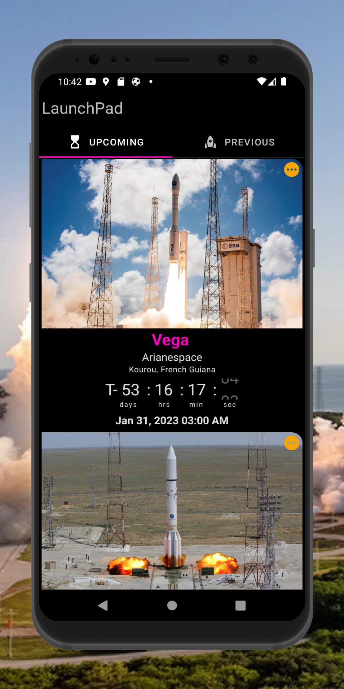
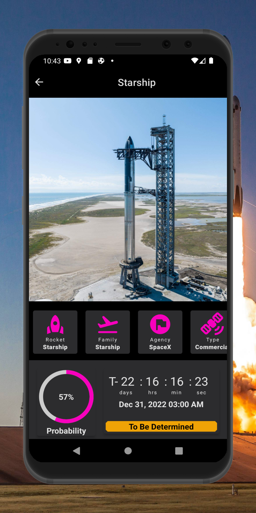
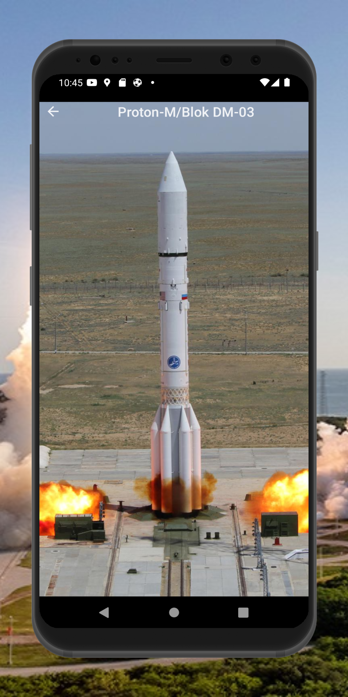
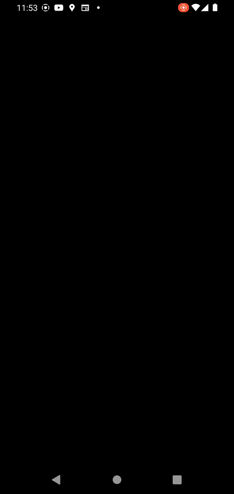
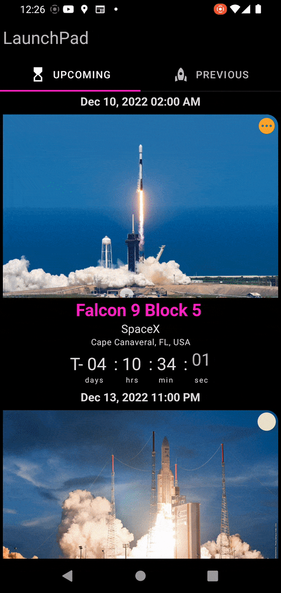
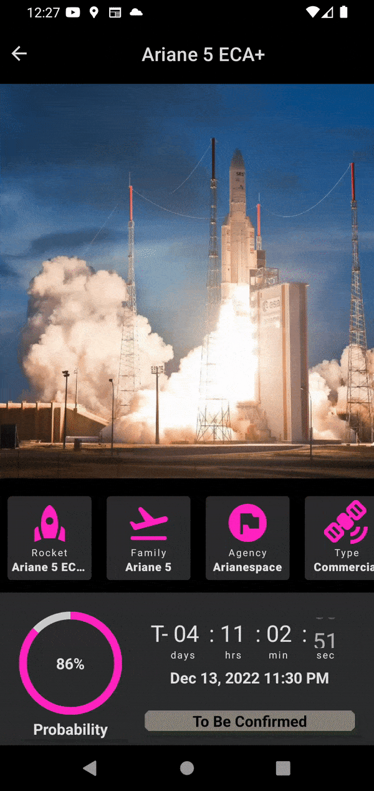
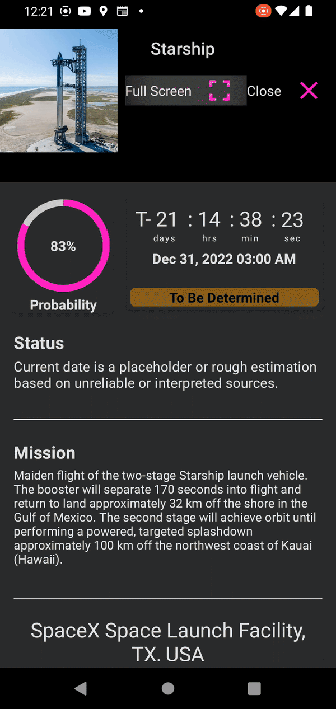

<br />
<div align="center">
  <a href="https://github.com/othneildrew/Best-README-Template">
    
  </a>

<h1 align = "center">
<b><i>LaunchPad</i></b>
</h1>

  <p align="center">
    An Android App for Space Events
    <br />
    <a href="#-screenshots-">Screenshots</a>
    ·
    <a href="#-screenshots-">Deployment</a>
    ·
    <a href="#-architecture-">Architecture</a>
    ·
    <a href="#-screenshots-">API Reference</a>
    ·
     <a href="#-technologies-">Technologies</a>
    ·
    <a href="#-screenshots-">Authors</a>
    ·
    <a href="#-license-">License</a>
  </p>
</div>

LaunchPad shows upcoming rocket launches and previous rocket launches. It is backed up by data from the Launch Library API a product by The Space Devs with an up-to-date database of Spaceflight events.

<a href='https://play.google.com/store/apps/details?id=com.uxstate.launchpad'></a>

## 📷 Screenshots 📷

This Project uses [**Material 2**](https://m2.material.io/design), which is a part of Google's open source design system for inituitive and consistent design patterns. 

<p align="center">
 &nbsp;&nbsp;&nbsp;&nbsp;
 &nbsp;&nbsp;&nbsp;&nbsp;   
 &nbsp;&nbsp;&nbsp;&nbsp; 

</p>

## :inbox_tray: Deployment :inbox_tray:

These are the key parameters for LaunchPad

| Parameter      	| Value  	|
|----------------	|--------	|
| compileSdk     	| 33     	|
| targetSdk      	| 33     	|
| minSdk         	| 26     	|
| composeVersion 	| 1.3.1  	|
| kotlinVersion  	| 1.7.20 	|


You can clone the repository or download or download the Zip file.

## 🛠️ Architecture 🛠️

LaunchPad is implemented using Android Clean Architecture and follows the Model-View-ViewModel 
(MVVM) pattern.

It features these main 3 layers:

**1. Data Layer** - This is the layer that dispenses data to the LaunchPad app. It features 2 
RemoteMediators (yes, :two: ) to provide paging functionality. It is flanked by a ROOM Database 
for data persistence. The API provides the remote data which is cached by the mediators 
into the ROOM database for offline operations.

**2. Domain Layer** - This layer holds the Business Logic for the LaunchApp. It holds the models and 
the use cases that  encapsulates the very complex business logic for the  app.

**3. UI Layer** - This is the presentation layer which directly interacts with the user. It displays
the  refined data to the user and facilitates interactions with the user.
It contains the ViewModel holding the different states for the Yummies App.

Launch has 4 Screen destinations which use Compose Destination to manage navigation.

| Splash Screen         | Overview Screen       | Detailed Screen       | Full Screen           |
|-----------------------|-----------------------|-----------------------|-----------------------|
|  |  |  |  |

### **Overview Screen** 
This screen is based on both TabLayout thanks to [**Accompanist Library**](https://github.com/google/accompanist). You can go into more details by following LaunchPad's tab implementation or [this blog](https://johncodeos.com/how-to-create-tabs-with-jetpack-compose/).

### **Details Screen**
The user navigates to the Details Screen by clicking on a launch item. The main feature is
the BottomSheet. The user can scroll up and down to reveal additional Launch details such as **Status**,
 **Mission** and **Launch Site**,


### **Full Screen**
When the user clicks on the full screen icon from the details screen, the app navigates to
the full screen to display the rocket image in full screen.

## :electric_plug: **API Reference** :electric_plug:
Yummies fetches its data from [**Launch Library 2 API**](https://thespacedevs.com/llapi/).
You can find the API Documentation by following this [link](https://ll.thespacedevs.com/2.2.0/swagger/).

### **Base URL** :globe_with_meridians:
https://lldev.thespacedevs.com/2.2.0/


### **API Key** :old_key:
You don't need an API Key
### Get Upcoming Launches :inbox_tray:


```http
    @GET("launch/upcoming")
```
This interface function takes *limit* and *offset* and returns *ApiResponseDTO*

| Parameter | Type    | Description                                        |
|-----------|---------|----------------------------------------------------|
| limit     | Integer | Number of results to return per page               |
| offset    | Integer | The initial index from which to return the results |


### Get Previus Launches :rocket:


```http
     @GET("categories.php")
```

This interface function takes *limit* and *offset* and returns *ApiResponseDTO*

| Parameter | Type    | Description                                        |
|-----------|---------|----------------------------------------------------|
| limit     | Integer | Number of results to return per page               |
| offset    | Integer | The initial index from which to return the results |


### Data Points for Launch Model

| Property        | Type     | Description                                                                   |
|-----------------|----------|-------------------------------------------------------------------------------|
| id              | Integer  | auto-generated unique identifier for the launch                               |
| name            | String   | name of the launch                                                            |
| mission         | Mission  | holds the name, type and Mission's description                                |
| imageUrl        | String   | link for the launch image                                                     |
| provider        | Provider | holds the name and Service Provider type                                      |
| status          | Status   | holds the abbreviation, name and Status description                           |
| pad             | Pad      | holds the location name, latitude, longitude, complex name and total landings |
| startWindowDate | String   | time for the start of the launch period                                       |
| rocket          | Rocket   | holds the name and rocket family                                              |


## :gear: Technologies used :gear:

LaunchPad project uses many popular libraries and tools in the Android Ecosystem

* [Android KTX](https://developer.android.com/kotlin/ktx) - helps to write more concise, idiomatic Kotlin code.
* [Jetpack Compose](https://developer.android.com/jetpack/compose) - modern toolkit for building native Android UI
* [Material Design 3](https://m3.material.io/) - an adaptable system of guidelines, components, and tools that support the best practices of user interface design.
* [Compose Destinations](https://github.com/raamcosta/compose-destinations) - used to handle all navigations and arguments passing while hiding the complex, non-type-safe and boilerplate code
* [ViewModel](https://developer.android.com/topic/libraries/architecture/viewmodel) to store and manage UI-related data in a lifecycle conscious way.
* [Dagger Hilt](https://dagger.dev/hilt/) - used for Dependency Injection.
* [Coil](https://coil-kt.github.io/coil/) - an image loading library for Android backed by Kotlin Coroutines
* [Retrofit](https://square.github.io/retrofit/) a REST Client for Android which makes it relatively easy to retrieve and upload JSON (or other structured data) via a REST based webservice.
* [Coroutines and Kotlin Flow](https://kotlinlang.org/docs/reference/coroutines-overview.html) - used to manage the local storage i.e. `writing to and reading from the database`. Coroutines help in managing background threads and reduces the need for callbacks.
* [Room](https://developer.android.com/topic/libraries/architecture/room) persistence library which provides an abstraction layer over SQLite to allow for more robust database access while harnessing the full power of SQLite.
* [Timber](https://github.com/JakeWharton/timber) - a logger with a small, extensible API which provides utility on top of Android's normal Log class.
* [Lottie Animations](https://lottiefiles.com/) - provides Lightweight and scalable animations files
## :hammer_and_pick: Architecture :hammer_and_pick:
Yummies is implemented using Android Clean Architecture with these key highlights:

Uses Model-View-ViewModel (MVVM) pattern with Clean Architecture (data, domain and presentation)
## Data Layer
The Data layer features a single repository flanked by  
a ROOM Database for data persistence and remote data from the API. The API provides
the remote data which is cached by the repository into the ROOM database for offline operations.
## Domain Layer
This layer houses the meal and category models and the use cases which encapsulates
the complex business logic for the Yummies app.
## UI Layer
Displays the Yummies refined data on the screen and facilitates interactions with the users.
It contains the ViewModel holding the different states for the Yummies App.

It has 3 Screen destinations which use Compose Destination to manage navigation.

#Overview Screen 1
This screen is based on both LazyColumn and LazyRow to present categories 
and recipes options.

There is also a search box where you can search a meal by name.

#Details Screen
You get here by selecting a specific meal item and the app navigates you
to the details screen.

You can now see an image of final cooked meals and ingredients. Pull up
the bottom sheet to reveal the cooking directions


## Contributing

Contributions to make Yummie better are always welcome!

If you are interested in seeing a particular feature implemented in this app, please open a new issue after which you can make a PR!


## License


MIT License

Copyright (c) [2022] [Tonnie Dev]

Permission is hereby granted, free of charge, to any person obtaining a copy
of this software and associated documentation files (the "Software"), to deal
in the Software without restriction, including without limitation the rights
to use, copy, modify, merge, publish, distribute, sublicense, and/or sell
copies of the Software, and to permit persons to whom the Software is
furnished to do so, subject to the following conditions:

The above copyright notice and this permission notice shall be included in all
copies or substantial portions of the Software.

THE SOFTWARE IS PROVIDED "AS IS", WITHOUT WARRANTY OF ANY KIND, EXPRESS OR
IMPLIED, INCLUDING BUT NOT LIMITED TO THE WARRANTIES OF MERCHANTABILITY,
FITNESS FOR A PARTICULAR PURPOSE AND NONINFRINGEMENT. IN NO EVENT SHALL THE
AUTHORS OR COPYRIGHT HOLDERS BE LIABLE FOR ANY CLAIM, DAMAGES OR OTHER
LIABILITY, WHETHER IN AN ACTION OF CONTRACT, TORT OR OTHERWISE, ARISING FROM,
OUT OF OR IN CONNECTION WITH THE SOFTWARE OR THE USE OR OTHER DEALINGS IN THE
SOFTWARE.

